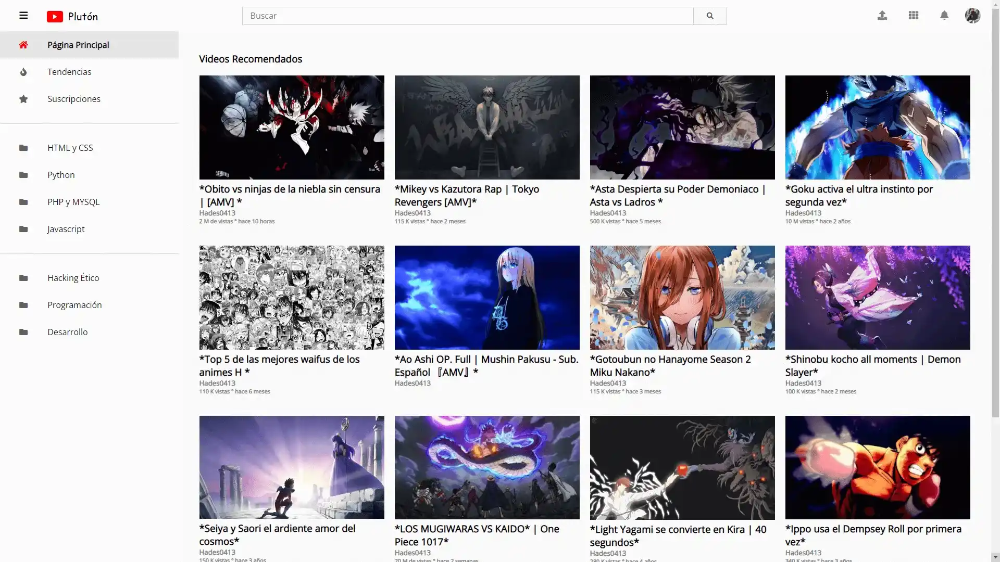
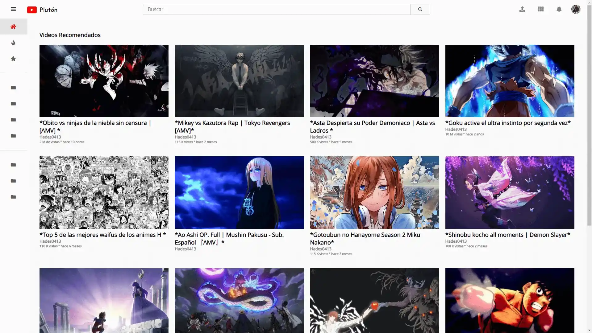
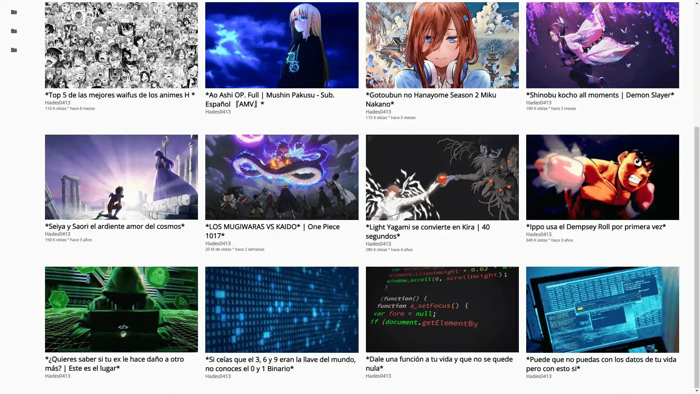

# PlutónYT

**PlutónYT**! Plutón es una aplicación web que simula una plataforma de videos como YouTube, permitiendo al usuario navegar por una serie de videos recomendados, buscar contenido, y explorar diferentes categorías de videos, todo en una interfaz simple y moderna.

## Índice

- [Descripción del Proyecto](#descripción-del-proyecto)
- [Tecnologías Utilizadas](#tecnologías-utilizadas)
- [Caracteristicas](#caracteristicas)
- [Estructura del Proyecto](#estructura-del-proyecto)
- [Funcionalidades](#funcionalidades)
- [Uso](#uso)
- [Contribuyentes](#contribuyentes)
- [Licencia](#licencia)
- [Imágenes y Videos](#imágenes-y-videos)

## Descripción del Proyecto

**Plutón/TiendaDeRopa** es una tienda online de productos con la capacidad de mostrar diferentes categorías de productos, agregar productos al carrito, y realizar compras. La tienda está construida usando HTML, CSS, y JavaScript, y utiliza localStorage para almacenar el carrito de compras de manera persistente entre sesiones.


## Tecnologías Utilizadas

Este proyecto utiliza las siguientes tecnologías y herramientas:

- **HTML5:** Estructura de la página.
- **CSS3:** Estilos de la página.
- **JavaScript:** Lógica de la tienda y del carrito de compras.
- **Font Awesome:** Íconos utilizados en la interfaz.
- **Google Fonts::** Fuentes personalizadas para la tipografía.

## Caracteristicas

Este proyecto incluye las siguientes características:

- **Página principal con videos recomendados:** Página principal con videos recomendados
- **Menú lateral interactivo:** Permite la navegación a través de diferentes categorías de videos (como HTML y CSS, Python, PHP y MySQL, etc.).
- **Diseño responsivo:** El diseño se adapta a diferentes tamaños de pantalla, optimizando la visualización en dispositivos móviles.
- **Gestión de menú lateral:** El menú lateral puede ser ocultado o mostrado según el tamaño de la pantalla.

## Estructura del Proyecto

La estructura del proyecto incluye los siguientes directorios principales:

```
└── 📁Clon_YT
    └── 📁imágenes
        └── hades.jpeg
        └── na1.jpg
        └── na10.jpg
        └── na11.jpg
        └── na12.jpg
        └── na13.gif
        └── na14.gif
        └── na15.gif
        └── na16.gif
        └── na2.jpg
        └── na3.jpg
        └── na4.jpg
        └── na5.jpeg
        └── na6.jpg
        └── na7.jpg
        └── na8.jpg
        └── na9.jpg
    └── 📁js
        └── main.js
    └── 📁public
        └── 📁img
            └── 📁README
                └── img2-2.webp
                └── img2-3.webp
                └── img2.webp
    └── index.html
    └── README.md
    └── style.css

```

## Funcionalidades

### 1. Menú Lateral Interactivo


El menú lateral es accesible a través de un botón de "hamburguesa" en la esquina superior izquierda. Este menú contiene enlaces a diferentes categorías de contenido, como:

```bash
Página Principal
```
```bash
Tendencias
```
```bash
Suscripciones
```
```bash
HTML y CSS
```
```bash
Python
```
```bash
PHP y MySQL
```
```bash
JavaScript
```
```bash
Hacking Ético
```
```bash
Desarrollo
```

El menú lateral es completamente interactivo, y su visibilidad se puede controlar tanto en dispositivos móviles como de escritorio.


### 2. Funcionalidad de Menú en Móviles:

En dispositivos móviles, el menú lateral se puede abrir y cerrar mediante el botón de menú. Esto se logra con la siguiente lógica en JavaScript:

```bash
const contenedor = document.querySelector('#contenedor');
document.querySelector('#boton-menu').addEventListener('click', () => {
    contenedor.classList.toggle('active');
});

const comprobarAncho = () => {
    if(window.innerWidth <= 768){
        contenedor.classList.remove('active');
    } else {
        contenedor.classList.add('active');
    }
}

comprobarAncho();
window.addEventListener('resize', () => {
    comprobarAncho();
});

```

### 3. Barra de Búsqueda

La barra de búsqueda permite a los usuarios buscar contenido en la plataforma. Está conectada con la interfaz de usuario mediante un input y un botón para iniciar la búsqueda.

### 4. Videos Recomendados

La página principal muestra una cuadrícula de videos recomendados. Cada video incluye información sobre el título, el nombre del creador y la cantidad de vistas.

### 5. Adaptabilidad del Diseño

El diseño es responsivo, lo que significa que se adapta a diferentes tamaños de pantalla. En dispositivos más pequeños (móviles), el menú lateral y otras partes de la página se ajustan para ofrecer una experiencia de usuario óptima.


## Uso


### 1. Visualización

Para visualizar la página:

°Clona o descarga este repositorio en tu máquina local.
°Abre el archivo index.html en tu navegador web.

```bash
git clone https://github.com/Hades0413/Clon_YT.git

cd Clon_YT

open index.html

```

### 2. Personalización

Puedes personalizar los videos y las imágenes cambiando los enlaces a los archivos en el directorio imágenes. Además, el archivo style.css contiene los estilos principales de la interfaz, que pueden ser modificados para adaptarlos a tus preferencias.


### 2. JavaScript

Los comportamientos interactivos, como la apertura y cierre del menú lateral, la barra de búsqueda y otras funcionalidades, se gestionan en el archivo main.js.

## Contribuyentes

```bash
Eduardo Miguel Jaime Gomero (Hades0413)
```

## Licencia

Este proyecto está bajo la Licencia MIT. Puedes usar, modificar y distribuir el código con fines personales o comerciales.

## Imágenes y Videos

### Imágenes:

A continuación, se muestran algunas imágenes del formulario de autenticación (AuthForm) y otras vistas relevantes:

1. 
2. 
3. 

Videos:
Demo del Proyecto:
Cómo ejecutar el Proyecto:

```

```
